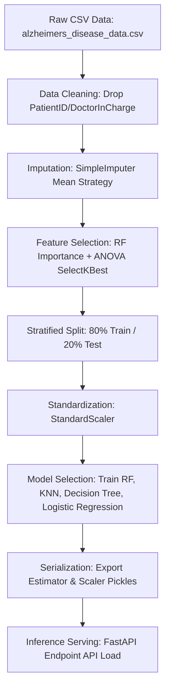

# Machine Learning Ingestion and Training Pipeline

This document explains the end-to-end Machine Learning lifecycle of the Alzheimer's Risk Prediction system, tracking data from raw CSV formatting through feature selection, model serialization, and live HTTP API inference.

---

## 1. Pipeline Overview

The ML pipeline is designed to ingest diagnostic records, extract optimal clinical features, split data into stratified sets, standardize numerical ranges, train and evaluate multiple candidate models, and output serialized model pickles.

---

## 2. Ingestion & Preprocessing

### Dataset Specifications
- **Source**: `data/alzheimers_disease_data.csv`
- **Total Records**: 2,149 patient records
- **Total Columns**: 35 columns (32 biometric/clinical parameters, 2 administrative columns, 1 diagnosis label)
- **Target Variable**: `Diagnosis` (Binary label: `0` = Low Risk, `1` = High Risk of Alzheimer's)

### Administrative Cleaning
To prevent model overfitting on arbitrary indices, the pipeline drops the identifier variables `PatientID` and `DoctorInCharge`.

### Missing Value Imputation
To guarantee mathematical completeness before running vector transformations, the pipeline implements scikit-learn's `SimpleImputer` with a **mean-value replacement strategy**:
$$x_{\text{imputed}} = \mu_{\text{feature}}$$
This replaces empty entries with the mean of the column, maintaining dataset variance without introducing structural bias.

---

## 3. Advanced Feature Selection

Instead of feeding all 32 clinical features directly into estimators (which increases noise and risks overfitting), the pipeline uses two complementary feature selection techniques:

1. **Random Forest Feature Importance**:
   Trains an auxiliary Random Forest model to measure Gini impurity reduction across all features. The top 5 indicators are selected.
2. **ANOVA F-value Test (`SelectKBest`)**:
   Runs a statistical univariate analysis (`f_classif`) to find the 5 features with the highest linear relationship to the target label.

### Combined Feature Subset
The unique union of the top Gini feature importances and top ANOVA statistical features are selected:
- **`MemoryComplaints`** (Neurological)
- **`FunctionalAssessment`** (Clinical Assessment score)
- **`MMSE`** (Mini-Mental State Examination score)
- **`ADL`** (Activities of Daily Living score)
- **`BehavioralProblems`** (Psychiatric)

The pipeline saves the selected feature map to `outputs/selected_features.txt`.

---

## 4. Train-Test Splitting & Standardization

### Stratified Validation Split
The dataset is split into **80% training data** (to optimize weights) and **20% testing data** (to evaluate generalization):
- **Stratification**: Implemented via `stratify=y` inside `train_test_split`. This guarantees that the proportion of Low Risk (0) and High Risk (1) diagnoses in both the training and test sets matches the raw dataset's exact ratio, preventing split-induced bias.
- **Random State**: Fixed at `42` to ensure split reproducibility.

### Scaling & Standardization
Estimators performing distance calculations (like KNN) or weight optimization (like Logistic Regression) are sensitive to variables with broad ranges (e.g., `Age` vs. binary flags). The pipeline fits a `StandardScaler` to translate feature elements to a uniform range where the mean is 0 and variance is 1:
$$z = \frac{x - \mu}{\sigma}$$
- **Preprocessor fit**: The scaler is fitted **only** on the training split `X_train` to prevent data leakage from the test split.
- **Transform**: Both training and test features are transformed using the fitted scaler parameters.

---

## 5. Estimator Training & Serialization

The pipeline trains 4 candidate machine learning models using the standardized training subset:
1. **Random Forest Classifier**: An ensemble bootstrap classifier aggregating decision trees.
2. **Logistic Regression**: A linear model mapping log-odds probability.
3. **Decision Tree Classifier**: A binary decision tree optimizing split node gini thresholds.
4. **K-Nearest Neighbors (KNN)**: A distance-based classifier clustering nearby coordinates.

### Model Metrics Comparison
Performance metrics (Accuracy, Precision, Recall, F1 Score, and ROC-AUC) are compiled in a sorted dataframe and exported to `outputs/metrics/model_metrics.csv`.

### Serialization
- The best performing model (Random Forest) is pickled using Python's `pickle.dump()` to `outputs/rf_alzheimers_model.pkl`.
- The corresponding preprocessor settings are pickled to `outputs/scaler.pkl`.

---

## 6. Live Prediction Inference Workflow

When a request lands on the live FastAPI backend `/predict` endpoint:
1. **Pydantic Validation**: Ingests JSON fields, validating data types.
2. **Clinical Mapping**: Converts subjective questionnaire responses to binary markers:
   - `Yes` $\rightarrow$ `1`
   - `No` $\rightarrow$ `0`
3. **Standardization**: Applies the standard scaler weights (`models/scaler.pkl`) to normalize values.
4. **Estimator Prediction**: Invokes the pickled Random Forest model to calculate the diagnostic class (Low Risk / High Risk) and return class probabilities.
