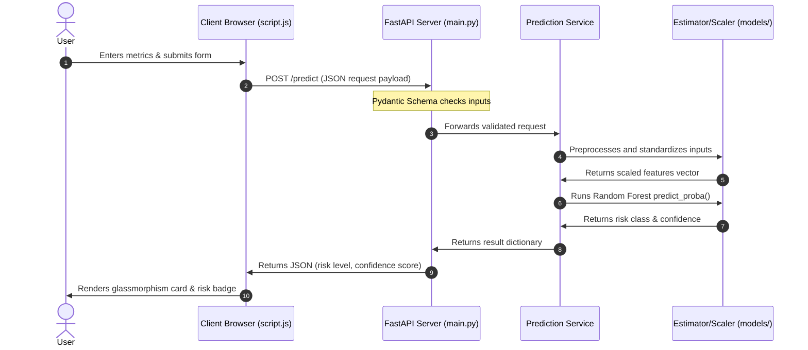

# Project Structure and System Architecture

This document provides a comprehensive breakdown of the `GENETIC_ML` workspace, explaining the architectural design, directory roles, component details, data/request flows, and Docker setup.

---

## 1. Directory Structure and Purpose

Below is the layout of the project, built for modularity, clean separation of concerns, and ease of deployment.

```
GENETIC_ML/
├── backend/                  # Python backend application
│   ├── app/                  # Main application package
│   │   ├── api/              # API endpoints and routers (routes.py)
│   │   ├── services/         # Coordinates ML preprocess & predict runs (prediction_service.py)
│   │   ├── ml/               # Estimator execution, preprocessing, and loaders
│   │   │   ├── model_loader.py         # Deserializes models at startup
│   │   │   ├── preprocessing.py        # Feature mapping logic
│   │   │   ├── predictor.py            # Standardizing & model inference logic
│   │   │   ├── alzheimers_pipeline.py  # Model training pipeline
│   │   │   └── evaluate_model.py       # Offline evaluation script
│   │   ├── schemas/          # Pydantic validation schemas (request.py, response.py)
│   │   ├── config/           # Application configurations placeholder
│   │   ├── utils/            # Shared utilities placeholder
│   │   ├── core/             # Core app settings / lifecycle settings placeholder
│   │   └── main.py           # App entry point (FastAPI server, templates/static mount)
│   ├── requirements.txt      # Python dependencies for the backend
│   └── Dockerfile            # Container definition for the backend
├── frontend/                 # Client UI assets (fully decoupled from backend code)
│   ├── static/               # Serves stylesheets (CSS) and client-side logic (JS)
│   └── templates/            # HTML page layouts/views (served by FastAPI Jinja context)
├── models/                   # Serialized production model weights and standard scalers
├── data/                     # Raw CSV clinical datasets used for training/validation
├── docs/                     # Architectural, structural and process documentation
└── outputs/                  # Training pipeline output charts, metrics, and logs
```

### Why Each Directory Exists
- **`backend/`**: Isolates all Python server-side execution code. It is cleanly partitioned into api, schema, service, and ML packages to promote modularity and facilitate unit testing.
- **`frontend/`**: Decouples UI pages and assets from logic code. The backend references this directory dynamically, keeping structural code distinct from frontend views.
- **`models/`**: Holds frozen, production-ready ML models (pickled estimators, preprocessors). Isolating models prevents them from being overwritten accidentally by training pipeline scripts.
- **`data/`**: Centralized storage for CSV datasets, preventing clutter in the root folder.
- **`outputs/`**: Workspace for training pipeline visual reports, confusion matrices, ROC curve PNG files, and metrics.
- **`docs/`**: Production-ready codebases house architectural documents here for developer onboarding and operational transparency.

---

## 2. Module Responsibilities

- **`backend/app/main.py`**:
  Initializes the FastAPI ASGI server, configures CORS, mounts the `/static` asset folder, sets up `Jinja2Templates` (with a custom Flask-compatible `url_for` global), registers the startup lifespan event handlers, and routes HTML views.
- **`backend/app/api/routes.py`**:
  Registers REST API routes for `/health`, `/metrics`, and `/predict`.
- **`backend/app/schemas/`**:
  Houses Pydantic data schemas to enforce strict input/output verification contracts:
  - `request.py`: Declares validation parameters for prediction metrics.
  - `response.py`: Declares validation parameters for endpoint JSON outputs.
- **`backend/app/services/prediction_service.py`**:
  Orchestrates request-to-prediction lifecycle. Interfaces with raw inputs, routes them to ML preprocessors, and executes predictors.
- **`backend/app/ml/model_loader.py`**:
  Singleton loader class. Deserializes estimator and scaler packages from `models/` once on startup, preventing repeated I/O reads.
- **`backend/app/ml/preprocessing.py`**:
  Performs data type normalization (coercing strings to floats) and translates subjective text elements into binary flags.
- **`backend/app/ml/predictor.py`**:
  Standardizes DataFrame features via standard scaling and calls inference estimations.

---

## 3. Data and Request Flows

### Request Flow
The following sequence describes what happens when a user submits a risk assessment:



### Serving Static Files and Templates

In FastAPI, templates and static assets are served using `StaticFiles` and `Jinja2Templates`. The template engine is customized to map Flask's `filename` arguments to Starlette's `path` arguments to support legacy HTML pages:

```python
@pass_context
def jinja2_url_for(context: dict, name: str, **path_params):
    request = context.get("request")
    if name == "static" and "filename" in path_params:
        path_params["path"] = path_params.pop("filename")
    return str(request.url_for(name, **path_params))

templates.env.globals["url_for"] = jinja2_url_for
```

---

## 4. Containerization and Docker Workflow

To ensure seamless production deployments, Docker containerization separates the build context from directory isolation.

### `backend/Dockerfile`
The Dockerfile is structured to run backend server dependencies:
- Base image: `python:3.11-slim` for minimal image footprints.
- Installs libraries listed in `backend/requirements.txt` (Leverages Docker caching layers by running `pip install` before copying application code).
- Copies files including the code directory, models, and frontend assets.
- Exposes port `5000`.
- Execution command: Launches a high-performance ASGI production server using `uvicorn`:
  `uvicorn backend.app.main:app --host 0.0.0.0 --port ${PORT} --workers 4`

### `docker-compose.yml`
The compose file coordinates build operations:
```yaml
services:
  alzheimers-app:
    build:
      context: .
      dockerfile: backend/Dockerfile
    container_name: alzheimers-flask
    environment:
      - PORT=5000
    ports:
      - "5000:5000"
    restart: unless-stopped
```
By setting the build `context` to the project root (`.`) and specifying the `dockerfile` at `backend/Dockerfile`, the Docker daemon can successfully resolve and copy sibling folders (such as `frontend/` and `models/`) into the final image.
