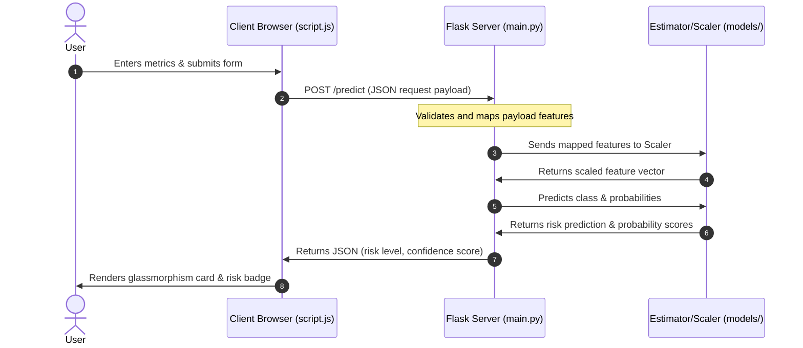

# Project Structure and System Architecture

This document provides a comprehensive breakdown of the restructured `GENETIC_ML` workspace, explaining the architectural design, directory roles, component details, data/request flows, and Docker setup.

---

## 1. Directory Structure and Purpose

Below is the updated layout of the project, built for modularity, clean separation of concerns, and ease of deployment.

```
GENETIC_ML/
├── backend/                  # Python backend application
│   ├── app/                  # Main application package
│   │   ├── api/              # Placeholder for modular api routing
│   │   ├── config/           # App configuration and constants
│   │   ├── core/             # Core app settings / startup logic
│   │   ├── ml/               # Machine Learning training & evaluation scripts
│   │   ├── models/           # DB schema and ORM models placeholder
│   │   ├── schemas/          # Data validation schemas (Pydantic, etc.) placeholder
│   │   ├── services/         # Business logic layer placeholder
│   │   ├── utils/            # Shared utilities and helpers
│   │   └── main.py           # App entry point (Flask routes, endpoints)
│   ├── requirements.txt      # Python dependencies for the backend
│   └── Dockerfile            # Container definition for the backend
├── frontend/                 # Client UI assets (fully decoupled from backend code)
│   ├── static/               # Serves stylesheets (CSS) and client-side logic (JS)
│   └── templates/            # HTML page layouts/views (served by Flask Jinja context)
├── models/                   # Serialized production model weights and standard scalers
├── data/                     # Raw CSV clinical datasets used for training/validation
├── docs/                     # Architectural, structural and process documentation
└── outputs/                  # Training pipeline output charts, metrics, and logs
```

### Why Each Directory Exists
- **`backend/`**: Isolates all Python server-side execution code. Isolating the backend folder makes it clean to migrate to framework layers like FastAPI, write backend tests, and manage container dependencies.
- **`frontend/`**: Decouples UI pages and assets from logic code. The backend references this directory dynamically, keeping structural code distinct from frontend views.
- **`models/`**: Holds frozen production-ready ML models (pickled estimators, preprocessors). Isolating models prevents them from being overwritten accidentally by training pipeline scripts.
- **`data/`**: Centralized storage for CSV datasets, preventing clutter in the root folder.
- **`outputs/`**: Workspace for training pipeline visual reports, confusion matrices, ROC curve PNG files, and metrics.
- **`docs/`**: Production-ready codebases house architectural documents here for developer onboarding and operational transparency.

---

## 2. Module Responsibilities

- **`backend/app/main.py`**:
  Initializes the Flask server, enables CORS, registers routing endpoints (`/`, `/predict`, `/dashboard`, `/metrics`), handles production model asset loading, and implements prediction serving logic.
- **`backend/app/ml/alzheimers_pipeline.py`**:
  The full ML pipeline script. Loads raw data, drops identifiers, conducts RF/SelectKBest statistical feature selection, trains 4 distinct models (Random Forest, Logistic Regression, Decision Tree, KNN), plots metrics, and outputs model packages.
- **`backend/app/ml/evaluate_model.py`**:
  An offline validation tool. Runs 5-fold cross-validation on the Random Forest estimator and outputs raw metrics (Accuracy, Precision, Recall, F1) to console for quick verification.

---

## 3. Data and Request Flows

### Request Flow
The following sequence describes what happens when a user submits a risk assessment:



### How Prediction Works
1. When a `POST` request lands on `/predict`, the backend parses input JSON parameters: `Age`, `BMI`, `BloodPressure`, `Cholesterol`, `MemoryComplaints`, `Confusion`, and `Forgetfulness`.
2. Dropdown metrics (`Yes`/`No`) are transformed to binary signals (`1`/`0`).
3. Inputs are mapped into a standardized 7-feature pandas DataFrame:
   `['Age', 'BMI', 'SystolicBP', 'CholesterolTotal', 'MemoryComplaints', 'Confusion', 'Forgetfulness']`
4. The global `StandardScaler` scales numeric variables.
5. The global `RandomForestClassifier` makes prediction inferences (`predict()` and `predict_proba()`).
6. Based on output probability, the API returns:
   - Prediction Label: `"High Risk"` or `"Low Risk"`.
   - Confidence Percentage: Probability of the predicted class.

### How Preprocessing Works
- **Imputation**: Missing clinical data in the pipeline is imputed with column-wise means using scikit-learn's `SimpleImputer`.
- **Feature Selection**: Selects a combined feature subset from Random Forest importances and `SelectKBest` (ANOVA F-value).
- **Standardization**: Features are standardized by subtracting the mean and scaling to unit variance using `StandardScaler` to ensure unbiased distance metrics.

### How the ML Model is Loaded
Upon start, `backend/app/main.py` parses its script location, resolves `PROJECT_ROOT`, and loads model assets from:
- `models/rf_alzheimers_model.pkl` (Estimator)
- `models/scaler.pkl` (Preprocessor)

These are loaded once into memory using `pickle.load()` on server initialization, ensuring ultra-low latency prediction response times (no disk I/O overhead on request handling).

---

## 4. Serving Static Files and Templates

In Flask, templates and static assets are usually looked up in folders adjacent to the main script. Since we relocated them to a standalone `frontend/` directory, the backend explicitly configures Flask at initialization:

```python
BASE_DIR = os.path.dirname(os.path.abspath(__file__))
PROJECT_ROOT = os.path.abspath(os.path.join(BASE_DIR, "..", ".."))

template_dir = os.path.join(PROJECT_ROOT, "frontend", "templates")
static_dir = os.path.join(PROJECT_ROOT, "frontend", "static")

app = Flask(__name__, template_folder=template_dir, static_folder=static_dir)
```
- **Templates**: Flask references `render_template('index.html')` and lookups are made under `frontend/templates/`.
- **Static Assets**: Stylesheets (`style.css`, `dashboard.css`) and script modules (`script.js`, `dashboard.js`) are served via `url_for('static', filename='...')` and dynamically loaded from `frontend/static/`.

---

## 5. Containerization and Docker Workflow

To ensure seamless production deployments, Docker containerization separates the build context from directory isolation.

### `backend/Dockerfile`
The Dockerfile is structured to run backend server dependencies:
- Base image: `python:3.11-slim` for minimal image footprints.
- Installs libraries listed in `backend/requirements.txt` (Leverages Docker caching layers by running `pip install` before copying application code).
- Copies files including the code directory, models, and frontend assets.
- Exposes port `5000`.
- Execution command: Launches a high-performance WSGI production server using `gunicorn`:
  `gunicorn --bind 0.0.0.0:${PORT} --workers 4 --threads 2 --timeout 60 backend.app.main:app`

### `docker-compose.yml`
The compose file coordinates build operations:
```yaml
services:
  alzheimers-app:
    build:
      context: .
      dockerfile: backend/Dockerfile
    container_name: alzheimers-flask
    environment:
      - PORT=5000
      - FLASK_ENV=production
    ports:
      - "5000:5000"
    restart: unless-stopped
```
By setting the build `context` to the project root (`.`) and specifying the `dockerfile` at `backend/Dockerfile`, the Docker daemon can successfully resolve and copy sibling folders (such as `frontend/` and `models/`) into the final image.
